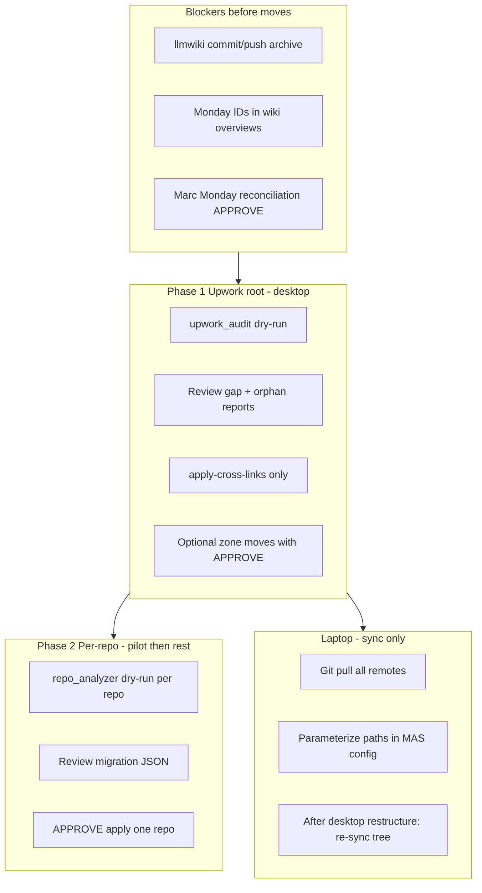

# Start Repo Restructuring (Desktop Canonical + Laptop Sync)

## Current state

**MAS foundation is done** ([TASKS.md](c:\Users\RicoS\MAS\TASKS.md)): scaffolder, `upwork_audit.py`, and `repo_analyzer.py` exist. A desktop audit already ran against `C:\Users\Nicol\Upwork` ([gap report](c:\Users\RicoS\MAS\llm_wiki\audits\upwork_gap_report.md), [inventory](c:\Users\RicoS\MAS\llm_wiki\audits\upwork_inventory.json)).

**Two restructuring layers** (per [prompts/2-client-template-explorer.md](c:\Users\RicoS\MAS\prompts\2-client-template-explorer.md)):

| Layer | Tool | Rule |
|-------|------|------|
| Upwork root | `scripts/upwork_audit.py` | Cross-links only; **never move git-tracked repos** without typed `APPROVE` |
| Single repo internals | `scripts/repo_analyzer.py` | Heuristic or `--use-gemini`; `--apply` only after human review |

**Laptop vs desktop mismatch** (checked on RicoS):

- `~/Upwork` exists but is **flat** (repos at root: `turo-fleet-automation-system`, `openclaw-elijah-workspace`, etc.).
- Canonical zones from the audit are **missing**: `clients/`, `projects/`, `proposal-system/`, `websites/`, `_archive/`, `~/Upwork/README.md`.
- Only `llmwiki/` matches the expected zone name.
- MAS hardcodes desktop paths in places ([orchestrator/domains.yaml](c:\Users\RicoS\MAS\orchestrator\domains.yaml), [orchestrator/upwork_paths.yaml](c:\Users\RicoS\MAS\orchestrator\upwork_paths.yaml), docs under `docs/`).
- Laptop: MAS repo cloned at `C:\Users\RicoS\MAS`, **no `.env`**, and local `~/Upwork/llmwiki` is behind remote `origin/master` (remote has newer Turo reconciliation/status docs not present locally yet).



---

## Phase 0 — Unblock restructuring (both machines)

These are on [TASKS.md](c:\Users\RicoS\MAS\TASKS.md) and should complete **before** any `--apply` moves.

1. **llmwiki remote-first sync gate (required)**  
   - Pull remote `llmwiki` before any planning/moves so both machines include latest source-of-truth docs:  
     - `Turo/decisions/2026-05-22_monday_wiki_reconciliation.md`  
     - `Turo/00_status_2026-05-21.md`  
     - `Turo/sources/marc_messages/2026-05-21_sms_audit_30d.md`  
   - Command: `git -C ~/Upwork/llmwiki pull --ff-only` on desktop and laptop.

2. **llmwiki archive backlog reconcile (desktop primary)**  
   - Re-check the local archive backlog after the remote pull (previously noted as 52 files in [client_workflows_summary.md](c:\Users\RicoS\MAS\llm_wiki\architecture\client_workflows_summary.md)).  
   - Review diff, commit, push from desktop.  
   - Pull on laptop after push so both machines share the same wiki head ([docs/OBSIDIAN_SETUP.md](c:\Users\RicoS\MAS\docs\OBSIDIAN_SETUP.md) sync rules).

3. **Monday pillar gaps**  
   - Audit flags `monday_workspace: false` for Turo and OpenClaw.  
   - Use the new remote reconciliation doc above as the current baseline for board `18408242353`.  
   - Document board IDs in `llmwiki/Turo/00_overview.md` and `llmwiki/OpenClaw/00_overview.md` (template: `~/.claude/kb/_reference/monday-board-template.md`).  
   - Run Marc reconciliation (`scripts/suggest_monday_from_messages.py`) with **human APPROVE** before any Monday posts (board `18408242353`).

4. **OpenClaw architecture doc** (can stay parallel but not blocking root moves)  
   - Draft `OpenClaw/concepts/workflow_architecture.md` after Turo PM loop is trusted.

---

## Phase 1 — Upwork root restructuring (desktop only)

Run on **`C:\Users\Nicol\Upwork`** when at the desk—not on the flat laptop tree until it is replaced/synced from desktop.

```powershell
cd C:\Users\Nicol\MAS
python scripts/upwork_audit.py --root ~/Upwork
# Review:
#   llm_wiki/audits/upwork_gap_report.md
#   llm_wiki/audits/orphan_moves.json
#   llm_wiki/audits/upwork_inventory.json

python scripts/upwork_audit.py --root ~/Upwork --apply-cross-links --bundles turo,openclaw
python scripts/upwork_audit.py --root ~/Upwork   # verify
```

**Expected outcomes from last audit (re-validate after run):**

- Turo / OpenClaw: four pillars OK except Monday documentation.
- Orphans: e.g. `git-check-out.txt` at root—review before `--apply-orphans`.
- Unmapped wikis (HateFreeFuture, Joshua, PremiumWebDesign): add to `KNOWN_BUNDLES` in [scripts/upwork_audit.py](c:\Users\RicoS\MAS\scripts\upwork_audit.py) only if they become active bundles.

**Physical zone alignment (if gaps show repos outside `projects/`):**

- `client-lead` rule: default is **cross-link in wiki**, not move repos ([orchestrator/agents/client-lead.md](c:\Users\RicoS\MAS\orchestrator\agents\client-lead.md)).
- If you later want `projects/` + `clients/` folders populated on disk, treat each move as a separate change list with `orphan_moves.json` + typed `APPROVE` for `--apply-orphans`—never bulk-move without review.

**Do not** use `scaffold_client.py` for existing clients; it is for **new** clients only.

---

## Phase 2 — Per-repo internal restructuring (pilot → rollout)

After Phase 1 inventory is current:

1. **Pick a pilot repo** (not MAS): e.g. `~/Upwork/projects/turo-fleet-automation-system` on desktop.  
   - Avoid running heuristic-only analysis on the MAS orchestrator repo (known false positives per [2026-05-22_mas-foundation-verification.md](c:\Users\RicoS\MAS\llm_wiki\postmortems\2026-05-22_mas-foundation-verification.md)).

2. **Generate plan (dry-run only):**

```powershell
python scripts/repo_analyzer.py `
  --path ~/Upwork/projects/turo-fleet-automation-system `
  --use-gemini `
  --output llm_wiki/plans/turo-migration-plan.json
```

3. **Human review** migration JSON against [four-pillar bootstrap](file:///C:/Users/RicoS/.claude/kb/_reference/new-client-project-bootstrap.md) and [templates/client-workspace/](c:\Users\RicoS\MAS\templates\client-workspace/).

4. **Apply one repo** with explicit gate: `--apply` + type `APPROVE` at prompt.

5. Repeat for OpenClaw repos (`openclaw-hiro-paragon`, `hirobooker-site`, wrapper workspace) after pilot lessons.

Target layout modules: `web_development/`, `automation_workflows/`, `ai_agents/`, `docs/`, etc. (from [templates/client-workspace/](c:\Users\RicoS\MAS\templates\client-workspace/)).

---

## Laptop reorganization (RicoS — sync to desktop, not restructure)

While away from the desk, treat the laptop as a **read/pull workstation** until the desktop tree is canonical.

| Task | Action |
|------|--------|
| MAS runtime | Copy [.env.example](c:\Users\RicoS\MAS\.env.example) → `.env` (API keys for Gemini analyzer only; no `ANTHROPIC_API_KEY` per [docs/CLAUDE_CODE_SETUP.md](c:\Users\RicoS\MAS\docs\CLAUDE_CODE_SETUP.md)) |
| Agents | `powershell -File orchestrator/install_agents.ps1 -Force` |
| Git remotes | `git pull` on `~/Upwork/llmwiki`, `turo-fleet-automation-system`, `openclaw-*`, `coastal-lux-site`, `upwork-proposal-system` (resolve duplicate: repo exists both at `~/Upwork/upwork-proposal-system` and `C:\Users\RicoS\upwork-proposal-system`—pick one canonical clone path) |
| Audit on laptop | **Dry-run only** for curiosity; do not `--apply-cross-links` or `--apply-orphans` on flat tree—it will not match `KNOWN_BUNDLES` paths until synced |
| Path portability | Small MAS edit (when implementing): replace hardcoded `c:/Users/Nicol/MAS` in [orchestrator/domains.yaml](c:\Users\RicoS\MAS\orchestrator\domains.yaml) with repo-relative or `$env:USERPROFILE`-based paths; add RicoS OneDrive path to [orchestrator/upwork_paths.yaml](c:\Users\RicoS\MAS\orchestrator\upwork_paths.yaml) if SMS backups sync there |
| Docs | Update [docs/CURSOR_SETUP.md](c:\Users\RicoS\MAS\docs\CURSOR_SETUP.md), [docs/OBSIDIAN_SETUP.md](c:\Users\RicoS\MAS\docs\OBSIDIAN_SETUP.md), [docs/obsidian-vault.json](c:\Users\RicoS\MAS\docs\obsidian-vault.json) to use `~/` or both `Nicol`/`RicoS` examples |
| Full tree parity | After desktop Phase 1: sync `~/Upwork` via OneDrive and/or re-clone into `clients/`, `projects/`, … layout; then `git pull` everywhere |

**Intake monitor note:** unattended proposal automation lives under `C:\Users\RicoS\upwork-proposal-system` per global CLAUDE.md—keep that path stable even if Upwork zones move.

---

## Suggested execution order (checklist)

1. Desktop + laptop: `llmwiki` `git pull --ff-only` (remote-first sync gate).  
2. Desktop: reconcile/push `llmwiki` local backlog after pull.  
3. Desktop: refresh audit + `--apply-cross-links` for active bundles.  
4. Desktop: document Monday board IDs; run SMS→Monday suggest flow with APPROVE using latest Turo reconciliation doc.  
5. Desktop: `repo_analyzer` dry-run on Turo pilot → review → single-repo `--apply`.  
6. Laptop: env + agents + git pull all remotes; defer physical Upwork reshaping.  
7. MAS coding pass: portable paths in `domains.yaml` / `upwork_paths.yaml` / docs.  
8. After desktop zones stable: sync laptop `~/Upwork` to match; re-run audit on laptop to confirm inventory.  
9. Roll per-repo migrations to remaining repos; postmortem to `llm_wiki/postmortems/`.

---

## What “done enough to start” means

You can **start Phase 1 today on desktop** once llmwiki is pushed and you have 30 minutes at `C:\Users\Nicol\Upwork`.

On the **laptop today**, you can start **Phase 0 git sync + MAS env setup** only—do not treat the flat `~/Upwork` tree as the migration target.

Per-repo `--apply` should wait until Phase 1 inventory is regenerated and the pilot migration JSON is reviewed.
